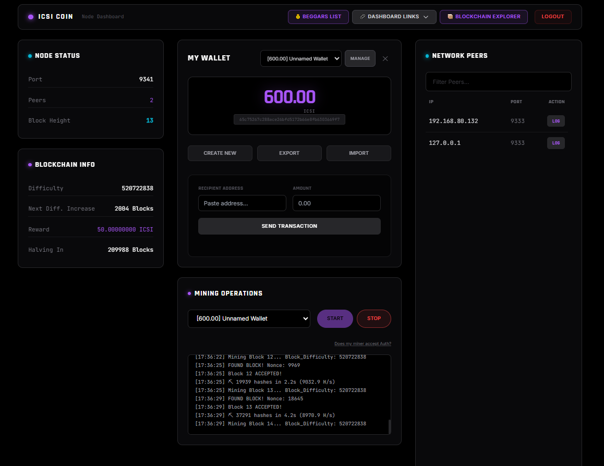
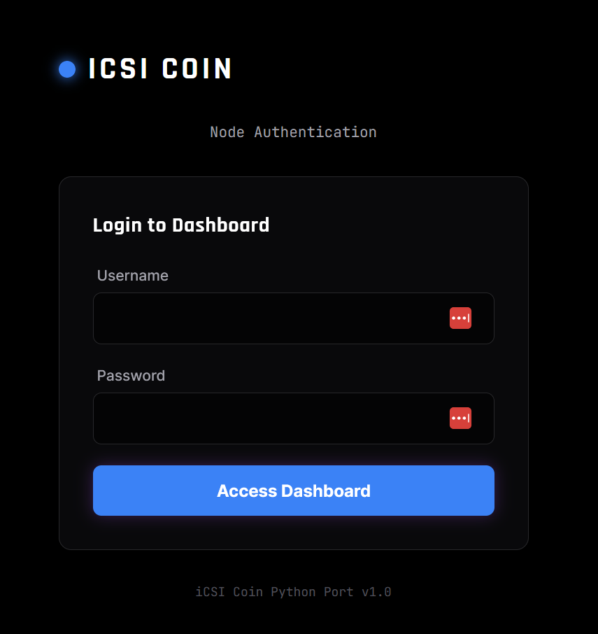

# Blockchain in a Box (Dockerized Crypto Nodes for the Classroom)
<p align="center">AKA: iCSI Coin</p>
<p align="center">
  
  <br>
  <em>iCSI Coin Miner</em>
</p>

## Disclaimer
> **Although this is a working peer-to-peer blockchain application, it is designed for educational purposes.**

Students will learn to:
*   Import/Export Public/Private Wallet Addresses.
*   Mine Coin using a web interface and RPC client (examining the mining process).
*   Understand Block Halving and Difficulty shifts as key economic controls.
*   Observe Peer-to-Peer network discovery and blockchain synchronization.

*(See the [`Concept_Docs`](https://github.com/androidteacher/iCSI_Coin_2026/tree/main/iCSI_COIN_PYTHON_PORT/Concept_Docs) folder for in-depth explanations of how this blockchain is constructed.)*

---

### A Word to the Wise
> "Placing this node on the public internet unleashes its peer-to-peer nature, potentially causing your blockchain to take on a life of its own. Once public, you will own the chain as much as Satoshi Nakamoto owns Bitcoin—which is to say, not at all."

**Just don't point it at or host it directly on a 'public' IP and you'll be fine.**

<p align="center"><em>Hosting this in a LAN is the best way to not 'accidentally' become the creator of the next big crypto breakout coin.<br>Remember, friends don't let friends become crypto bros!</em></p>

---

## Install

**Kali Linux (2025/2026)** is the easiest way to run this project, as it supports the `docker run` scripts out of the box.

First, ensure Docker is installed:
```bash
sudo apt install docker.io docker-compose
```

Clone the repository and enter the project folder:
```bash
git clone https://github.com/androidteacher/iCSI_Coin_2026.git
cd iCSI_Coin_2026/iCSI_COIN_PYTHON_PORT
```

### Startup Scripts
To start the environment, navigate to the `STARTUP_SCRIPTS` folder and verify your target configuration:

```bash
cd STARTUP_SCRIPTS
# Launch a full 4-node cluster with STUN server
./start_full_stack.sh

# OR launch a single end-user node
./start_user_node.sh
```

*Do the `docker run` commands/startup scripts seem broken?*
Install the latest version of docker: [Click Here](https://cyberlessons101.com/docker)

### Blockchain Reset Scripts
If you need to wipe the blockchain data and start fresh, use the reset scripts.

> **CAUTION:** In order to reset the blockchain and start over, you need to make sure there are no nodes online or communicating. Resetting the blockchain requires a quiet network and you have to eliminate the possibility that old nodes with previous blockchain data don't log in and commandeer your fresh blockchain! 

I've been working with a group of 4-5 nodes. Resetting the blockchain and starting over has been easy so far.

```bash
cd BLOCKCHAIN_RESET_SCRIPTS

# Reset the full 4-node cluster
./clear_stack.sh

# OR reset a single end-user node
./clear_end_user_node.sh
```

### End User Node (Quick Rebuild)
If you need to update the admin or end-user node codebase without deleting your data (e.g. after a `git pull`), use the `BUILD_THIS_NODE.sh` script.

```bash
cd end_user_node
./BUILD_THIS_NODE.sh
```

---


## Final Step
Log in at **http://localhost:8080** and create a username and password.

<p align="center">
  
  <br>
  <em>iCSI Coin: Taking over the world one block at a time!</em>
</p>

## Lesson Plan/Teacher Guide
For a comprehensive lesson plan and teacher guide, please visit:
[Blockchain in a Box: Dockerized Crypto Nodes for the Classroom](https://www.notion.so/Blockchain-in-a-Box-Dockerized-Crypto-Nodes-for-the-Classroom-3024c8e52376808c9fa8dddcce5dddd5)

## License

**This software is Open Source.**

This program is free software: you can redistribute it and/or modify it under the terms of the **GNU General Public License** as published by the Free Software Foundation, either version 3 of the License, or (at your option) any later version.

This program is distributed in the hope that it will be useful, but **WITHOUT ANY WARRANTY**; without even the implied warranty of **MERCHANTABILITY** or **FITNESS FOR A PARTICULAR PURPOSE**. See the GNU General Public License for more details.
